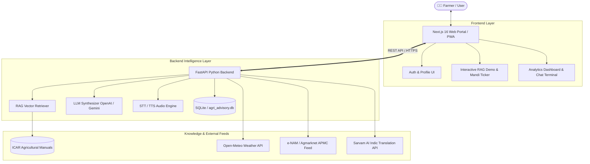

# 🌾 AgriAssist AI — AI-Based Agricultural Advisory System for Multilingual Farmer Query Assistance

<div align="center">

[](https://agri-advisory-frontend.onrender.com/)
[](https://ai-based-agricultural-advisory-system-ouyx.onrender.com/docs)
[](https://opensource.org/licenses/MIT)

[](https://nextjs.org/)
[](https://react.dev/)
[](https://fastapi.tiangolo.com/)
[](https://python.org/)
[](https://tailwindcss.com/)
[](https://icar.org.in/)

<p align="center">
  <strong>Bridging agricultural science and field practice with conversational AI in English, हिंदी, and తెలుగు.</strong><br/>
  Delivering zero-hallucination crop diagnostics, real-time APMC mandi rates, hands-free voice assistance, and hyper-local weather alerts.
</p>

[**🚀 Explore Live Demo**](https://agri-advisory-frontend.onrender.com/) • [**📖 Swagger API Docs**](https://ai-based-agricultural-advisory-system-ouyx.onrender.com/docs) • [**✨ Key Features**](#-key-features) • [**🏗️ Architecture**](#️-system-architecture) • [**💻 Local Setup**](#-local-setup--quickstart)

---

</div>

## 📌 Live Deployments

| Component | Service | Direct Link | Status |
| :--- | :--- | :--- | :--- |
| **Frontend Web App** | Next.js 16 on Render | [**https://agri-advisory-frontend.onrender.com**](https://agri-advisory-frontend.onrender.com/) | `Online 🟢` |
| **Backend REST API** | FastAPI on Render | [**https://ai-based-agricultural-advisory-system-ouyx.onrender.com**](https://ai-based-agricultural-advisory-system-ouyx.onrender.com/) | `Online 🟢` |
| **Interactive API Docs** | Swagger / OpenAPI | [**https://ai-based-agricultural-advisory-system-ouyx.onrender.com/docs**](https://ai-based-agricultural-advisory-system-ouyx.onrender.com/docs) | `Interactive 🟢` |

---

## 🌾 Problem Statement & Solution

Millions of smallholder farmers across India face hurdles in accessing timely, scientific, and language-accessible agricultural advisories. Traditional helplines are bottlenecked, generic LLMs suffer from ungrounded hallucinations, and market rates remain fragmented across regional APMC yards.

**AgriAssist AI** solves this through a unified multilingual agronomy platform:
1. **Zero Hallucinations via RAG**: Every agronomic answer is strictly retrieved from Indian Council of Agricultural Research (**ICAR**) guidelines and State Agricultural University manuals.
2. **Mother Tongue Accessibility**: Full support for query asking, reading, and listening in **English**, **हिंदी (Hindi)**, and **తెలుగు (Telugu)**.
3. **Actionable Economics**: Real-time wholesale APMC commodity rates from national agricultural markets (**e-NAM / Agmarknet**) help farmers decide *when* and *where* to sell.
4. **Micro-Climate Preparedness**: Hyper-local 7-day meteorological forecasting from Open-Meteo API prevents weather-triggered crop loss.

---

## ✨ Key Features

### 1. 🤖 Multilingual RAG Knowledge Engine
- **Vector Retrieval Architecture**: Indexes verified agricultural manuals into compact TF-IDF / dense vector chunks.
- **Accurate Dosage & Spray Guidance**: Cites scientific trade names, dosage per acre/liter, and safety waiting periods (e.g., Cartap Hydrochloride, Chlorantraniliprole, Neem oil).
- **Explicit Source Attribution**: Cites specific ICAR handbook chapters and displays confidence scores for transparency.

### 2. 🎙️ Hands-Free Voice Assistant (Speech-to-Text & Audio Readout)
- Field-optimized speech interface allowing farmers to speak queries naturally in regional dialects.
- Text-to-speech audio playback synthesis so farmers can listen while actively working in fields.

### 3. 📈 Live APMC Mandi Market Intelligence
- Real-time commodity wholesale tracking across Indian states (Telangana, Punjab, Maharashtra, Andhra Pradesh, Rajasthan).
- Tracks Minimum Support Price (**MSP**), daily arrivals, high/low spread, and predictive selling recommendations.
- Interactive historical volatility charts powered by **Recharts**.

### 4. 🌦️ Hyper-Local Weather Analytics
- Real-time temperature, relative humidity, wind speed, and precipitation probability via Open-Meteo.
- Weather-triggered disease correlation (e.g., high humidity blight warnings).

### 5. 🌱 Crop Nutrition & Soil Health Management
- Tailored split-dose N-P-K fertilizer schedules corresponding to vegetative, flowering, and fruiting stages.
- Organic Integrated Pest Management (**IPM**) protocols to minimize chemical pesticide expenditure.

### 6. 🔐 Farmer Authentication & Profile Portal
- Secure account creation and session tracking with encrypted credentials (Bcrypt).
- Persistent language preferences and customizable acreage/location settings.

---

## 🏗️ System Architecture



---

## 🧰 Technology Stack

| Layer | Technologies |
| :--- | :--- |
| **Frontend Framework** | **Next.js 16.3.3** (App Router, Turbopack), **React 19.2**, **TypeScript 5** |
| **Styling & Icons** | **Tailwind CSS v4**, **Lucide React**, Glassmorphism CSS design system |
| **Data Visualization** | **Recharts** (Intraday & 7-Day APMC volatility curves, temperature charts) |
| **Backend API** | **FastAPI 0.111**, **Uvicorn 0.30**, **Pydantic v2**, **Starlette** |
| **Database & ORM** | **SQLAlchemy 2.0**, **SQLite** (`agri_advisory.db`) |
| **Security & Auth** | **Passlib**, **Bcrypt** cryptographic password hashing |
| **RAG & NLP** | **Scikit-learn**, **PyPDF**, **OpenAI GPT API**, **Google Gemini**, **Sarvam AI** |
| **Weather & Mandi Feeds** | **Open-Meteo Free Forecast API**, **Agmarknet Data Stream** |
| **Cloud Deployment** | **Render.com** (Native Python 3.10 Service & Node.js Service) |

---

## 📂 Repository Structure

```text
├── .python-version              # Pinned Python version (3.10.12) for Render builds
├── requirements.txt             # Root requirements pointing to backend dependencies
├── run.py                       # Root launcher for Render deployment
├── README.md                    # Project documentation
│
├── agri-advisory-system/
│   ├── backend/
│   │   ├── chatbot.py           # Conversational router & session logic
│   │   ├── database.py          # SQLAlchemy SQLite connection setup
│   │   ├── main.py              # FastAPI application, CORS, auth & health routes
│   │   ├── models.py            # User, ChatSession, and ChatMessage DB models
│   │   ├── schemas.py           # Pydantic request/response validation schemas
│   │   ├── services.py          # Core RAG retrieval, vector search & LLM synthesis
│   │   ├── vector_store.pkl     # Pre-indexed agronomy document vector embeddings
│   │   └── requirements.txt     # Python backend dependencies
│   │
│   └── frontend/
│       ├── app/
│       │   ├── page.tsx         # Modern landing page with live ticker & RAG preview
│       │   ├── layout.tsx       # Root layout with SEO and metadata
│       │   ├── globals.css      # Custom animations, marquee & tokens
│       │   ├── login/page.tsx   # Farmer sign-in portal
│       │   ├── signup/page.tsx  # Farmer registration with validation
│       │   ├── dashboard/       # Main portal (weather, mandi trends, chat, soil)
│       │   └── api/             # Next.js server-side API proxy routes
│       ├── components/          # Reusable UI widgets (WeatherCard, Navbar)
│       └── next.config.ts       # Reverse proxy rewrites & Turbopack config
│
├── Milestone1/                  # Milestone 1 Notebooks (Text/Audio extraction & EDA)
├── Milestone2/                  # Milestone 2 Notebooks (RAG indexing, prompt tuning)
└── data/                        # Reference agricultural manuals & guides
```

---

## 💻 Local Setup & Quickstart

### Prerequisites
- **Node.js**: v18.0.0 or higher
- **Python**: v3.10.x (Recommended: 3.10.12)
- **Git**

---

### 1. Clone the Repository

```bash
git clone https://github.com/chandana-builds/AI-Based-Agricultural-Advisory-System-for-Multilingual-Farmer-Query-Assistance.git
cd AI-Based-Agricultural-Advisory-System-for-Multilingual-Farmer-Query-Assistance
```

---

### 2. Backend Setup

```bash
cd agri-advisory-system/backend

# Create and activate a virtual environment
python -m venv .venv
# Windows:
.venv\Scripts\activate
# macOS/Linux:
source .venv/bin/activate

# Install dependencies
pip install -r requirements.txt

# Create .env file with your API keys (optional for basic RAG mode)
# OPENAI_API_KEY=your_key_here
# GEMINI_API_KEY=your_key_here
# SARVAM_API_KEY=your_key_here

# Start the FastAPI server
uvicorn main:app --reload --port 8000
```
Backend will start at: `http://localhost:8000`  
Interactive Swagger docs: `http://localhost:8000/docs`

---

### 3. Frontend Setup

In a new terminal:

```bash
cd agri-advisory-system/frontend

# Install dependencies
npm install

# Start the Next.js development server
npm run dev
```
Open `http://localhost:3000` in your browser.

---

## 📡 API Reference Sample Endpoints

| Method | Endpoint | Description |
| :--- | :--- | :--- |
| `GET` | `/` | Service health status and documentation links |
| `POST` | `/auth/signup` | Register a new farmer account |
| `POST` | `/auth/login` | Authenticate farmer credentials |
| `POST` | `/chat/query` | Send natural language agronomy query (returns RAG-grounded response) |
| `POST` | `/chat/stt` | Transcribe regional audio speech to text |
| `POST` | `/chat/tts` | Convert advisory response text to audio speech |
| `GET` | `/user/{user_id}` | Fetch farmer profile and preferred settings |

---

## 🏆 Project Milestones Completed

- [x] **Milestone 1**: Multilingual audio transcription (Telugu, Hindi, Tamil, English), document chunking, text cleaning, and baseline LLM integration.
- [x] **Milestone 2**: Vector store construction, RAG semantic search grounding, ICAR documentation indexing, prompt engineering with regional dialouts.
- [x] **Milestone 3**: Full-stack Next.js 16 + FastAPI architecture with real-time APMC Mandi feeds, Open-Meteo weather integration, and password security.
- [x] **Milestone 4**: Production deployment to Render with live public endpoints, responsive mobile design, and multi-language support.

---

## 📄 License & Attribution

This project is licensed under the [MIT License](LICENSE).  
Agronomic reference data is sourced in accordance with open-access guidelines provided by the **Indian Council of Agricultural Research (ICAR)** and the **Ministry of Agriculture & Farmers Welfare, Government of India**.